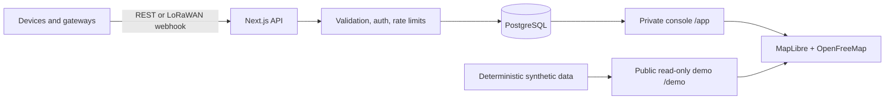

# uplotr

**Open-source location tracking for IoT developers and makers.** Send coordinates over REST or a LoRaWAN webhook, then inspect live device state and replay movement history on a fast MapLibre map.

[Website](https://uplotr.com) · [Live synthetic demo](https://uplotr.com/demo) · [Documentation](https://uplotr.com/docs) · [Discussions](https://github.com/iblh/uplotr/discussions)

> **Public Beta — v0.2.0-beta.1.** uplotr is suitable for evaluation, maker projects, and self-hosted deployments. Back up location data before upgrades. The official instance does not offer public registration or accept visitor location uploads.

## What works today

- Generic REST ingestion with bearer API keys
- LoRaWAN webhooks for The Things Network, Helium, and ChirpStack payloads
- Live device state, online/offline status, battery, RSSI, and SNR
- Historical paths, point view, time filtering, and trajectory replay
- MapLibre + OpenFreeMap by default; Mapbox is optional
- Single-owner private console with administrator-managed users and keys
- PostgreSQL persistence, retention cleanup, Docker Compose, and Vercel deployment
- Public, deterministic, read-only demo that never touches the production database

Not included in this Beta: open registration, multi-tenant SaaS, alerts, native MQTT/Kafka adapters, or a commercial SLA. These are roadmap items, not advertised features.

## Five-minute Docker start

```bash
git clone https://github.com/iblh/uplotr.git
cd uplotr
cp .env.prod.example .env
# Set strong AUTH_SECRET, DB_PASSWORD, and CRON_SECRET values in .env
docker compose -f docker-compose.prod.yml up -d
```

Open `http://localhost:3000/login`, create the owner account, then create an API key in **Settings → Access and security**. The full key is displayed once.

```bash
curl -X POST http://localhost:3000/api/v1/ingest \
  -H "Authorization: Bearer YOUR_API_KEY" \
  -H "Content-Type: application/json" \
  -d '{"device_id":"tracker-01","lat":37.7749,"lon":-122.4194,"battery":98}'
```

See the [Quick Start](docs/QUICK_START.md), [Deployment Guide](docs/DEPLOYMENT.md), and [API Reference](docs/API_REFERENCE.md) for complete instructions.

## Architecture



The public website and demo are isolated from private tracking data. API routes enforce their own authorization; the request proxy is used only for page navigation.

## Development

Requires Node.js 22, pnpm 10, and PostgreSQL.

```bash
pnpm install
cp .env.example .env
pnpm exec prisma migrate dev
pnpm dev
```

Before opening a pull request:

```bash
pnpm lint
pnpm typecheck
pnpm test
pnpm build
```

CI also runs real-Postgres integration tests, browser smoke tests, a production dependency audit, and a Docker build.

## Security and data responsibility

Internet-facing deployments should use `AUTH_MODE=REQUIRED`, strong unique secrets, HTTPS, a connection-pooled PostgreSQL database near the application, and regular encrypted backups. Location data is sensitive; do not attach real payloads, coordinates, credentials, or logs to public issues.

Please report suspected vulnerabilities privately as described in [SECURITY.md](SECURITY.md).

## Roadmap

1. Offline and low-battery notifications
2. Native MQTT adapter plus webhook retry and idempotency
3. Richer read-only/admin roles
4. Geofences, exports, and bulk device management
5. Multi-tenancy and optional open-registration SaaS

## Community and license

Questions and ideas belong in [GitHub Discussions](https://github.com/iblh/uplotr/discussions); actionable defects belong in Issues. See [CONTRIBUTING.md](CONTRIBUTING.md), [CODE_OF_CONDUCT.md](CODE_OF_CONDUCT.md), and [SUPPORT.md](SUPPORT.md).

Licensed under [Apache-2.0](LICENSE).
